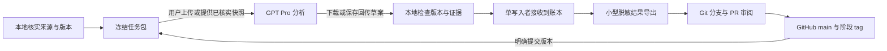

# ICML 2026 贡献审计：GPT Pro、本地 Codex 与 GitHub 协作方案

更新：2026-09-26。本文是当前协作主文档，说明任务归属、阶段交付、上传边界及同步办法。根目录原有 `AGENTS.md`、`PROJECT_SPEC.md` 和 `configs/project_policy.json` 继续约束实际工作；不另造冲突规则。

已完成两篇有明确限制的模型初筛闭环：Hedging 的65页当前附件、49页原稿和32页前作；
Foundations 的23页当前附件和30页前作。第二篇两个真实 Pro 对话各返回7项分析，
均经隔离导入、幂等核验和本地限定事实检查；贡献卡和局部证据图已生成。
两篇论文整体新意均为 U；第二篇仅对同条件有限置换群平均子机制保留局部覆盖判断。
人工审计/校准、完整证明认证和实验复现未做，账号记忆隔离未知。

十篇便利候选的官方主轨 spotlight 身份已分别核实；这不是会议总体。
当前本地12个PDF、9篇文献，其中3篇是目标论文；第三篇43页已抽取，真实 Pro 审读尚未开始。
第二篇原稿和所有正式 camera-ready 映射仍有缺口。四请求 API 下载已成功；扩展十篇清单
已通过本地验证，联网扩展尚未执行。正文、数据库和原始交换包留本地。

新增受目录/来源/代码版本约束的下载清单，最多10篇、20个精确PDF URL，失败即停。
修正前作误计入十篇目标上限的问题；未知和混合身份仍保守计入目标，前作升级目标也受限。
完整离线验收160项：158通过、2跳过、0失败，含四项实际中断恢复。
代码变化后已用新短任务重核目录及两篇结果；历史任务和 Pro 哈希没有改写。
P2继续逐篇推进，P3/P4未授权，未创建PR或合并main。

**本地负责可验证的执行，GPT Pro 对话负责有证据的分析与质疑，GitHub 保存经过审阅的代码、规则和结果版本。用户负责研究范围、重要裁决及发布决定。**

项目仓库：[izzyno1/icml2026](https://github.com/izzyno1/icml2026)，由用户指定，当前为公开仓库。最初只提交 README、`.gitignore`、PR 模板；现已在功能分支按 `docs/PUBLICATION_FILES.json` 同步源码、规则与小型脱敏检查点。正文、运行库及原始交换包留本地。以下尚未验收的后续阶段仍是实施方案。

2026-09-25 接入检查：GitHub 插件已安装/启用，但连接器调用返回 `Unknown tool`。本轮使用已登录的 Chrome 网页完成文档交付，连接器和本地 Git 推送认证仍需分别实测。每次交付后在本地记录远端 SHA 和文件哈希；仓库页面存在不代表完整项目已同步。

换窗口只需使用同目录 `新窗口启动提示词.txt`；本文为唯一主文档，原技术交接作为本地附件供 Codex 按需读取。其他准备工作和未测项目按下表与后续门槛处理。

## 1. 当前起点

| 项目 | 当前真实状态 |
| --- | --- |
| Windows 环境 | 已在本地项目重建；Python 3.12.14、Git 2.53.0.windows.3、已有 Codex CLI 可用 |
| 本地根目录 | `C:\Projects\icml2026`；唯一 `.venv`，不依赖已删除的 E 盘 |
| 基础能力 | UTF-8、SQLite、HTTPS、内置搜索、现有 ChatGPT 登录、一次极小 CLI 任务及独立沙箱边界测试通过 |
| 离线验收 | 本轮 160 项：158 通过、2 个符号链接权限案例跳过；含四个实际强制中断后的新进程恢复 |
| 最小账本与保护 | 已有单写入账本、版本/租约、幂等接收、恢复和受管理 PDF 下载保护；不等于完整研究平台 |
| 真实研究 | 2 篇模型初筛闭环；3 篇主轨论文、6 篇前作，共 12 个 PDF；10 条身份已核对便利候选，总体未知 |
| Git | 活动分支 `codex/g0-exchange`；源码基线已在分支，main 仍为最初三份文档；未合并 |
| Pro 任务包导出/回传导入 | `G0_02_pro_002` 真实返回已完成；格式与合成事实分别验收，未做人类审计 |
| GitHub 同步 | 明确文件清单和远端回执记录代码/文档同步；运行态留本地，Git 推送认证仍未测 |

本机详细环境记录保存在 `reports/setup_report.json`，本地交接附件为 `ICML2026_正式工作交接.md`。二者含机器信息，留在本地，不是 GitHub 发布材料。旧报告中的 E 盘命令和历史测试数量不是当前入口。

## 2. GPT Pro 和本地分别做什么

这里的“GPT Pro”指用户在 ChatGPT Pro 对话界面中使用当时实际可用的模型，不是 API 密钥、云端 Codex 工作器或自动抓取服务器。不预先指定一个未经核对的模型名称。

| 工作 | GPT Pro 对话负责 | 本地 Codex / Python 负责 | 谁判定完成 |
| --- | --- | --- | --- |
| 研究问题与编码本 | 澄清概念、列边界案例、质疑创新分级、提出修订理由 | 保存规则版本、变更记录和受影响任务 | 用户决定口径；人工校准另记 |
| 官方目录与论文身份 | 复核容易混淆的轨道、撤回、版本和同名情况 | 受限采集、去重、核对官方来源、时间戳与覆盖表 | 本地以实际来源验收；不由模型猜总体数 |
| 正文与前作取证 | 提出需补充的前作候选、章节和实验问题 | 下载、SHA-256、版本分离、页/章节抽取、关键页图片、磁盘保护 | 实际字节和身份验收 |
| 主张提取与贡献对照 | 核读给定材料，逐条比较任务、假设、机制、成本、保证与评测 | 提供定位完整的任务包，保存返回草案，验证引用和覆盖 | 证据核查通过才接收 |
| 独立质疑 | 新对话根据同一证据独立判断，查漏前作、反例、过度和过低评价 | 固定输入版本，记录分歧、复核范围及未解决项 | AI 复核不等于人类裁决 |
| 图与统计 | 检查边的语义、分类假设、抽样设计和解释 | 图数据校验、计算、去重、可重跑脚本、图表导出 | 数值重算与语义核查分别验收 |
| 个人实验 | 提出最小实验、预测、对照和失败条件 | 估算本机资源；获准后运行可控实验并记录结果 | 实测结果；不推算个人录用概率 |
| 工程与恢复 | 讨论设计或审阅给定改动 | 写代码、安装最小依赖、测试、SQLite、恢复、存储检查 | 本机实际执行 |
| 上传与同步 | 阅读明确给定的仓库快照；返回建议 | 审阅文件、Git 提交/推送、接收反馈、维护同步回执 | 远端提交可核实才称已同步 |

Pro 可以搜索候选来源，但对话里的链接只是检索线索：本地还需取得并核对真实来源。Pro 应先列出实际可见/已读文件，不能仅凭文件名或项目记忆声称读完。专业判断不足时保留未知；不能用“用户点击同意”代替专家逐条审计。

普通 ChatGPT 项目不会因为写入了本地路径就获得电脑文件；需实际传递材料。用户已授权本地 Codex 操作现有 Chrome 的 Pro 对话并保存真实返回，合成包以完整内联文本完成；不依赖新插件。GitHub 连接可作为已核实快照的可选读入口，但不能假定能写仓库、读到未提交文件或即时刷新。[OpenAI 项目与聊天文档](https://learn.chatgpt.com/docs/projects)

## 3. 三处各保存什么

| 位置 | 职责 | 不承担的职责 |
| --- | --- | --- |
| 本地 SQLite + 证据对象 | 当前任务、来源字节、已读范围、attempt、结果验收、失败与恢复的运行记录 | 不让多个聊天或电脑同时改同一活动库 |
| GitHub `main` + 提交/tag | 经审阅的代码、规则、研究决策、小型来源清单与结果快照 | 不用作 PDF 仓库、活动数据库或整机备份 |
| GPT Pro 对话 | 某一任务包的分析过程、候选主张、质疑与回传草案 | 不做最终事实库，不以聊天记忆覆盖本地账本 |

代码和规则由 Git 版本化；运行事实由本地账本维护；公开到仓库的结果是指定时间点的导出。GitHub Issue 只追踪工作和讨论，不作为第二个能独立修改“已验收”状态的账本。



任务包导出/隔离导入与真实 Pro 合成往返已验收；图表与论文发布链条未完成。用户已授权本地 Codex 操作现有 Chrome 的 Pro 对话；合成包以完整内联文本实际传递，不能把本机文件路径当作 Pro 已读。

## 4. 分阶段拆分与上传计划

所有 tag 名均为建议，当前没有创建。每个阶段先有实际验收，再发布；部分失败可以提交代码和阻塞报告，但不得标成该阶段完成。

| 阶段 / 任务编号 | GPT Pro 的输入与工作 | 本地的输入与工作 | 上传 GitHub 的内容与时机 | 完成门槛 |
| --- | --- | --- | --- | --- |
| G0-01 协作初始化 | 阅读本文，指出研究分工或审计标准的歧义 | 使用用户指定的 `izzyno1/icml2026`；核对上传内容与远端提交 | 首批仅 README、忽略规则和 PR 模板；后续再审阅原规则、源代码及测试基线 | 分别记录文档上传和代码同步状态；核对远端提交 |
| G0-02 交换协议 | 检查一个纯合成任务包是否足够分析、能否明确返回证据定位 | 实现最小导出/导入和同步回执，测试重复、陈旧和损坏输入 | 合约、代码、合成测试和脱敏验收摘要；通过后提交 | 不需要真实论文即可完成一轮往返 |
| P0/P1 基础基线 | 无需重做环境；可审阅恢复与失败说明 | 核对已有验收哈希，补做确实未测的能力；不重复安装 | 可移植的环境摘要、代码与测试；建议 tag `p1-baseline-v1` | 已测/未测分开；不能把 2 项跳过记为通过 |
| P2-01 官方目录 | 审阅身份/轨道/版本边界案例 | 新建 `P2_catalog_002`，核实目录、来源、录用/撤回与版本；受限分页取题录 | 小型覆盖表、排除理由和访问失败记录；有一批可靠记录即可提交 | 不把活动总数、历史样本或猜测卷号当总体 |
| P2-02 单篇取证 | 收到论文本身、必要前作与明确问题后核读 | 选一篇可取得证据的主轨论文，记录便利选择；受保护下载并生成定位材料 | 该篇来源清单和对象哈希；正文留本地 | 真实身份、版本、字节、定位可核对 |
| P2-03 单篇贡献分析 | 首轮贡献对照；另一个对话独立质疑 | 核对引用、补取必要前作；接收有效结果、保留分歧 | 已审阅贡献卡、局部图、小型证据索引；建议 tag `p2-onepaper-v1` | 一篇真实闭环及恢复验证完成 |
| P2-04 最多十篇 | 每篇/主张分别分析；定期讨论分类边界 | 默认并发一，逐篇取证、接收、重算图与覆盖表 | 每完成一篇或一个有意义小批次提交；建议 tag `p2-pilot10-v1` | 最多十篇；完整度逐项列出，U 不被填成确定标签 |
| P3-A 约五十篇容量试点 | 检查异常案例与测量设计 | 另获用户阶段授权后测真实吞吐、失败率、存储增长 | 可重跑代码、脱敏容量数据和报告；建议 tag `p3-capacity-v1` | 属工程容量样本，不自动成为审计样本 |
| P3-B 30—50 边界案例校准 | 提出解释、争议和规则修订建议 | 单独记录校准样本角色、人工逐条裁决、规则版本与冻结日期 | 编码本、裁决依据、分歧记录；建议 tag `rubric-v1` | 必须有人实际审计；不能用 Pro 代替人类 |
| P4 概率审计/扩大范围 | 审阅抽样方案、漏查风险和解释 | 用户确认试点与预算后才做全量题录/初筛和独立概率审计；保存抽样概率 | 方法、受控元数据分片、估计脚本、区间和未知项；按批次提交 | 不从十篇便利样本推全会比例；未经校准只称模型初筛 |
| P5 综合结果与练习 | 综合证据、质疑结论、设计三个可检验练习 | 重算最终图表、验证可复跑性、打包轻量交付 | 报告、图、卡片、复现入口及阶段 Release | 结论可回到证据，实测与计划分开 |

当前授权到 P2。两篇模型初筛闭环已验收，第三篇待审读；逐篇扩展至最多十篇。版本与前作缺口继续保留，恢复时先读当前检查点。P3/P4 不自动启动。

## 5. 单个任务怎样交给 Pro

为每个外部审读指定 `review_id`、`paper_id` 和 `review_round`。一个对话只处理一篇论文的一个阶段，或一个明确主张与前作的对照，不把整个会议塞进同一条长对话。

本地导出的包至少包含：

| 文件 / 字段 | 必须包含 |
| --- | --- |
| `TASK.md` | 唯一目标、要回答的问题、规则摘录、限制、输出格式、未知项和停止条件 |
| `manifest.json` | review_id、schema_version、导出时间、代码基准 commit、规则/代码/提示哈希、任务包文件哈希、来源版本与证据快照 ID |
| `sources.json` | source_id、稳定论文身份、真实 URL、角色、SHA-256、页/章节定位、已提供/已读/缺失范围 |
| 阅读材料 | 本篇及必要前作的可定位材料；必要公式/图表关键页。关键上下文不能只剩摘要 |
| 问题清单 | 作者声称什么、最近前作是什么、可比条件是什么、缺什么才能判断 |

任务包原始 PDF 和大文本只在本地/用户实际上传的对话中传递，不默认进入 GitHub。只提供节选时，Pro 必须明确只读了节选；需要全文就提出具体补充请求。没有读到的文献不能写成排除过。

Pro 回传 `review.json`，配一个便于阅读的解释即可。至少带回 review_id、收到的基准版本、实际显示的模型名称（不明就 unknown）、实际读过的来源与范围、claim_id、主张类别、证据定位、前作共同点/差异、条件、不确定性、建议标签和补充请求。哈希由本地计算；Pro 只原样回传收到的值，不凭空生成。

### 长对话不要占着短租约

现有本地任务租约默认 300 秒，不能让等待人工在 Pro 对话中操作的任务保持 running 数小时或数天。交换协议应保存不可变的待审包和 waiting 状态；返回后先核对原输入版本，再开启短暂的本地导入/验收 attempt。不要倒填或伪造 Pro 持有过的 lease token。

现有 `workflow.py` 已新增 `export-pro` / `import-pro`，先用本机 `--help` 核对参数。
导入只进入待事实核验，不把 Pro JSON 直接当作科学验收结果写入 results 表。

### 返回后本地做什么

1. 保存未经改写的返回件到 `exchange/inbox/<review_id>/`，计算返回文件哈希。这个目录不提交 Git。
2. 检查 review_id、输入/规则/代码/证据版本、来源和定位。代码或规则改变，或来源字节不同，标记 stale 并安排重审；不能把旧结论换个标签就接收。
3. 校验重复回传是否已经处理，格式与引用是否完整；再实际检查关键原文是否支持判断。Schema 通过只证明结构，不证明事实。
4. 如果 Pro 提出新的来源，先作为候选，待本地取回和核实后才成为证据。
5. 接收由本地单写入者完成；保存 AI 初筛、独立 AI 复核、人类审计三个独立状态。未解决分歧继续保留。
6. 导出脱敏成果，再走 Git 分支/PR。不得让 Pro 修改 main 或直接覆盖已验收结果。

独立复核可用新对话先盲读同一证据包，初次不提供原标签，再比较分歧。若共享项目记忆可能带入此前结论，要如实记录，不能称完全盲法；AI 对话间的一致也不是专家共识。

## 6. GitHub 目录与上传清单

实际仓库为用户指定的公开仓库 `izzyno1/icml2026`，不再另建原建议名称的仓库。公开仓库只接收已审阅的代码、政策和脱敏结果，不包含本机私有运行记录。开始时用一个仓库和一个主要工作分支即可，不需要 GitHub Projects 看板、多个数据库或复杂平台。GitHub 支持用 README 说明项目，并以分支/PR 审阅改动。[GitHub 仓库最佳实践](https://docs.github.com/en/repositories/creating-and-managing-repositories/best-practices-for-repositories)

下图列出发布布局；已交付范围以发布清单为准，部分审读材料不等于完整论文验收：

```text
README.md                         当前协作主文档
AGENTS.md / PROJECT_SPEC.md        原始根规则
configs/project_policy.json       可移植项目政策
configs/rubric.json                编码本及其版本
src/ tools/ tests/ contracts/      已审阅的代码、测试、合约
docs/                             实现说明、经审阅的方法决策
reference/                        必要历史实现；标明未复核样本
.github/PULL_REQUEST_TEMPLATE.md   本轮已准备
published/                        仅放已审阅的小型发布导出
  status.json                     阶段、覆盖与阻塞摘要
  environment/                    脱敏环境与测试摘要
  snapshots/<snapshot_id>/         来源清单及版本 manifest
  papers/<paper_id>/<review_id>/   贡献卡与证据索引
  graphs/                         局部图数据/小图
  methods/                        决策、冻结规则与样本设计
  milestones/                     阶段验收说明
```

| 内容 | GitHub 策略 |
| --- | --- |
| README、原规则、实际代码、测试、合约 | 按明确文件清单审阅后提交，不直接 `git add .` |
| 本机环境信息 | 只导出版本、测试结果、规则/代码哈希等必要摘要；去除用户路径与原始会话输出 |
| 论文身份、来源 URL、SHA、版本角色、定位、缺失状态 | 以小型、不可变快照提交；元数据不能冒充保存了全文 |
| 贡献卡、模型初筛结果、争议、图、方法决策 | 本地接收和审阅后提交；标明证据和人工审计状态 |
| 论文 PDF、完整抽取文本、全部页面图片、缓存、下载分片 | 留本地；不默认重发布全文或搬到 Git LFS |
| SQLite/WAL、NOW 原始运行状态、完整会话/CLI 日志、Pro 原始来回包 | 留本地；需要公开的状态由程序另行脱敏导出 |
| `.venv`、`.tools`、备份、机器路径清单、认证文件/密钥 | 不上传；不得读取或复制认证内容来做“同步包” |

本轮已补充 `.gitignore` 排除本机报告、整个活动 state/data、exchange、历史 handoff 和机器路径清单。这不是秘密扫描器，也不能保护被强制加入或已跟踪的文件。Git 对已跟踪文件不会因新增忽略规则自动停止跟踪，提交前仍需看暂存清单。[GitHub 忽略文件说明](https://docs.github.com/en/get-started/git-basics/ignoring-files)

建议本项目的发布策略限制为单个导出文件不超过 5 MB、单批新增不超过 20 MB，超出则先拆分并审阅。这是**建议的项目发布检查阈值，尚未写入执行器**，也不是 GitHub 限额或 40/50 GB 本地容量预算。GitHub 当前对普通单对象有 100 MB 强制上限；不要把该上限当成适合存论文库的目标。[GitHub 仓库限制](https://docs.github.com/en/repositories/creating-and-managing-repositories/repository-limits)

GitHub 不保存正文和运行库，因此从仓库 clone 不能还原完整研究现场。需要本地备份保留数据库、唯一证据及清单；恢复后核验哈希。仓库的来源链接可能失效，不能因此删除本地唯一原件。

## 7. 如何保持同步

### 默认节奏：显式检查点，不做无条件自动同步

- **任务开始前**：检查工作区未提交内容，读取本地账本；有 remote 时 fetch 查看远端变化。工作区不干净时先保存明确改动，不直接覆盖或自动 stash 整个目录。
- **给 Pro 前**：代码/规则基线已提交；生成不可变任务包，记录 `base_commit` 和证据快照。没有首次提交时只可做标为 synthetic 的 G0-02 往返，不发布真实结论。
- **Pro 返回时**：导入隔离区，核对基线和证据，再接收。主分支仅因无关文档更新前进不一定使分析失效；应比较实际代码/规则/依赖来源哈希，不能只按日期判断。
- **完成一个小单元后**：本地 commit 保存已审阅内容；确认目标仓库后 push 当前分支。每篇或每个功能一份清楚的 PR，不要求每几分钟上传。
- **阶段结束时**：合并已审阅 PR，确认 main 与发布快照一致，再打阶段 tag/Release。结果标签仍为模型初筛时，Release 也不能升级成事实验证。
- **换窗口前**：更新账本生成的本地 NOW，导出小型状态，记录最后本地提交、远端分支提交、尚未上传的任务、待回传 review_id 和下一任务。不能只写“已同步”。

### 固定版本，不只给 Pro 一个会变化的 main 链接

任务包中的 `base_commit` 指向准备该包时的代码/规则基线，证据由各自 SHA-256 绑定。上传后可给 Pro 指向具体 commit 的文件链接，并附相同版本的必要文件。连接器若无法证明读到该版本，使用手动上传的包。

不要把某个文件所属提交的 SHA 写回该文件再提交，形成自指版本循环。基准 commit 写进包；这次发布本身的 commit SHA 在提交/推送完成后写入本地 `exchange/sync_receipts/`。该回执不进 Git，至少记录：

```text
snapshot_id, base_commit, rules_hash, code_hash
review_ids, exported_file_hashes, evidence_manifest_hash
local_commit, remote_branch, remote_commit, verified_at
remote_verified, unsynced_items, next_task_id
```

只有实际远端分支 SHA 等于本次推送的本地 SHA，才能记录这个检查点已上传。PR 合并后 main 的 SHA 可能改变，应重新取得合并提交并更新后续基准，不能继续把功能分支 SHA 当 main。

### 单人项目的分支规则

若仍为空远端，可在 `codex/setup` 建立经审阅的基线后推送 main。若已用网页或插件提交首批文档，远端已有历史：先取得该历史，在保留本地未跟踪代码的前提下衔接分支，不能再创建互不相关的首次提交后强推。之后 `main` 保存已审阅状态，具体工作使用 `codex/g0-exchange`、`codex/p2-onepaper`、`codex/p2-pilot10` 等分支。默认一个人一个活动写入工作区；不依赖一份活动 SQLite 在多台机器/同步盘上同时修改。

可以为阶段/论文建立 Issue 并链接 PR；这是准备好的规划，不代表本轮已创建 Issue。分支保护、自动检查和 Actions 仅在确认账户支持、额度和需要后启用；本轮不启用付费服务或持续云任务。单人审阅也要看 diff，不能因为 Pro 说通过就直接合并。

### 发生冲突或网络失败

- push 失败但本地 commit 成功：记录“本地已保存、远端未同步”，网络恢复后确认分支再重试，不声称已上传。
- remote 有新提交：先审阅，快进可用 `--ff-only`；分叉或冲突交由本地按实际差异处理。不要 force push、`reset --hard` 或用旧副本盖掉新证据。
- 两份结果意见不同：保留两份及其证据版本，做裁决任务；不是普通 Git 文本冲突，也不能直接取“最新”或多数票。
- 输入变更：将受影响结果标为 stale，发新 review_id。原稿/定稿/修订字节分别保留。
- 新电脑恢复：先取得代码，再恢复经过校验的本地证据与数据库备份；GitHub 小型导出不是活动库备份。

## 8. 历史首批文档交付与源码基线流程

目标远端为 `https://github.com/izzyno1/icml2026.git`。本节记录最初三份协作文件的交付流程；当前源码范围以发布清单和远端同步回执为准，不能把 Git 文档当作运行态备份。

1. 复用上述仓库，不再新建。连接器可用时优先用于文件操作；当前实测失败，使用已有 Chrome 登录进行文档上传。浏览器登录、连接器认证、本地 Git 推送认证分别核验。
2. 首批上传范围固定为 README、.gitignore、PR 模板，去除本机记录。网页提交使用已登录账号实际提供的身份；本地 Git 提交另需核对作者身份，不猜邮箱，不改全局身份。
3. 网页/插件可先建立仅有三份文档的远端历史；记录并读回该提交，不能宣称源码已同步。本地首次推送必须先衔接远端历史。若改走纯本地初始化路线，才从未初始化的空远端建立 main。
4. 先暂存明确文件，查看 `diff --cached` 和文件大小；本地运行适当测试，并准备真实脱敏摘要。代码/规则变化时重新生成离线验收。
5. 后续代码基线完成检查后，添加已核实的 HTTPS remote，衔接真实远端历史，再提交/推送已审阅分支。以后走分支/PR；插件可读写不代表本地 Git 已取得推送认证。
6. 读取远端 refs 核对提交，再记录同步回执。登录或组织授权由用户完成；不创建或回显 PAT，不把令牌塞入 remote URL。

连接、提交和后续推送应遵循 GitHub 当前官方步骤；网页文档提交不等于本地推送认证已配置。[GitHub 将本地代码加入仓库](https://docs.github.com/en/migrations/importing-source-code/using-the-command-line-to-import-source-code/adding-locally-hosted-code-to-github)

可立即运行的**只读检查**：

```powershell
Set-Location -LiteralPath 'C:\Projects\icml2026'
& .\tools\git-project.cmd status --short
& .\tools\git-project.cmd remote -v
& .\tools\git-project.cmd diff --cached --name-only
& .\tools\python-project.cmd tools\workflow.py status
& .\tools\python-project.cmd tools\workflow.py preflight
```

本轮交付完成后 remote 应指向上述地址；先实际运行 `remote -v` 确认。可以用 `fetch origin` 查看变化，用 `ls-remote --heads origin` 核实分支；公共仓库的读取成功不能证明有推送权限。

## 9. 下一窗口的具体工作单

| 顺序 | 执行者 | 输入 → 实际产物 | 验收 |
| --- | --- | --- | --- |
| 1 | 本地 Codex | 本文、原规则、机器报告和账本 → 恢复检查记录 | 目录/权限/空间/版本均核对，未测不升级 |
| 2 | 本地 Codex | 本文第 5、7 节 → 最小 Pro 任务包与回传协议实现 | 合成输入往返；重复导入不双计；损坏哈希/错误来源/陈旧版本拒绝；中断可恢复 |
| 3 | 用户 + GPT Pro | 合成包 → 可核验的结构化回传 | 真正看见文件、版本和返回字段；不产生论文判断 |
| 4 | 本地 Codex | 返回件 → 导入验收、脱敏发布预览、同步回执能力 | 测试通过；实际论文闭环仍记零 |
| 5 | 用户 + 本地 Codex | 现有 GitHub 文档历史 + 已审阅源码清单 → 工程代码基线 | 明确 remote、上传范围及实际远端 SHA |
| 6 | 本地 Codex + GPT Pro | 新 `P2_catalog_002` 与一篇真实论文 → 单篇闭环 | 全链条验收后才扩展到十篇 |

GitHub 写入连接或 Pro 回传暂缺时，本地继续独立的代码、测试和文件准备；不能伪造远端成功或 Pro 已读。G0 已通过，首篇 `P2_J4wRLmh29t_loop_001` 已接收。下一篇 `P2_aIH1jyU37z_screening_001` 已交实际 Pro；从账本与 P2 检查点读取进度，不重新认领旧任务。新下载的其他候选需分别登记，科学验收仍逐篇进行，不能用下载数量代替论文闭环。

## 10. 全程保持的限制

项目预算仍为 40 GB 预警、50 GB 停止新增高占用任务，每个实际使用卷至少留 30 GB。Git 历史、打包临时文件、Pro 交换包和外部缓存同样计入；实际下载由代码执行限额，写一份配置不等于实施配额。

使用现有 ChatGPT 登录，不新增付费 API、云账户、服务器、插件或 MCP。保留工作区边界与审批；不改全局执行策略，不执行论文作者脚本。没有外部归档时，不删除唯一原文。

来源版本、前作核读、语义复核、规则校准、人工裁决和代码测试是不同层。最多十篇仍为非概率试点，模型初筛不能称“已测真实创新比例”；引用不等于继承，缺父节点不等于首创，组合不等于低价值。阶段扩大和公开发布需遵守用户明确授权，不承诺关闭会话后自动运行。
