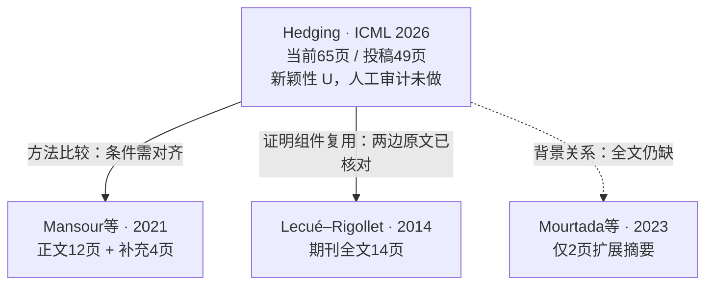

# 首篇证据关系图（模型初筛，非总体谱系）

箭头从本篇指向相关前作，表示图上写明的关系。比较和背景引用不计方法继承；
证明组件复用也不表示整篇等价或低价值。图中缺少父节点不能支持首创判断。

[逐项版本与证明核对](../papers/OR_J4wRLmh29t/version_checks_001.json)记录来源 ID、
物理页码、直接证据与推断。原始投稿和当前附件必须分别读取；正式定稿角色仍未知。
此前两轮 Pro 使用选页；新的146页完整文本审读等待真实返回，尚无完整论文闭环。
[来源和字节哈希](../evidence/P2_J4wRLmh29t.json)；[机器可读图](P2_J4wRLmh29t_partial.json)。
